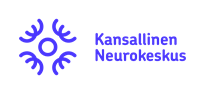
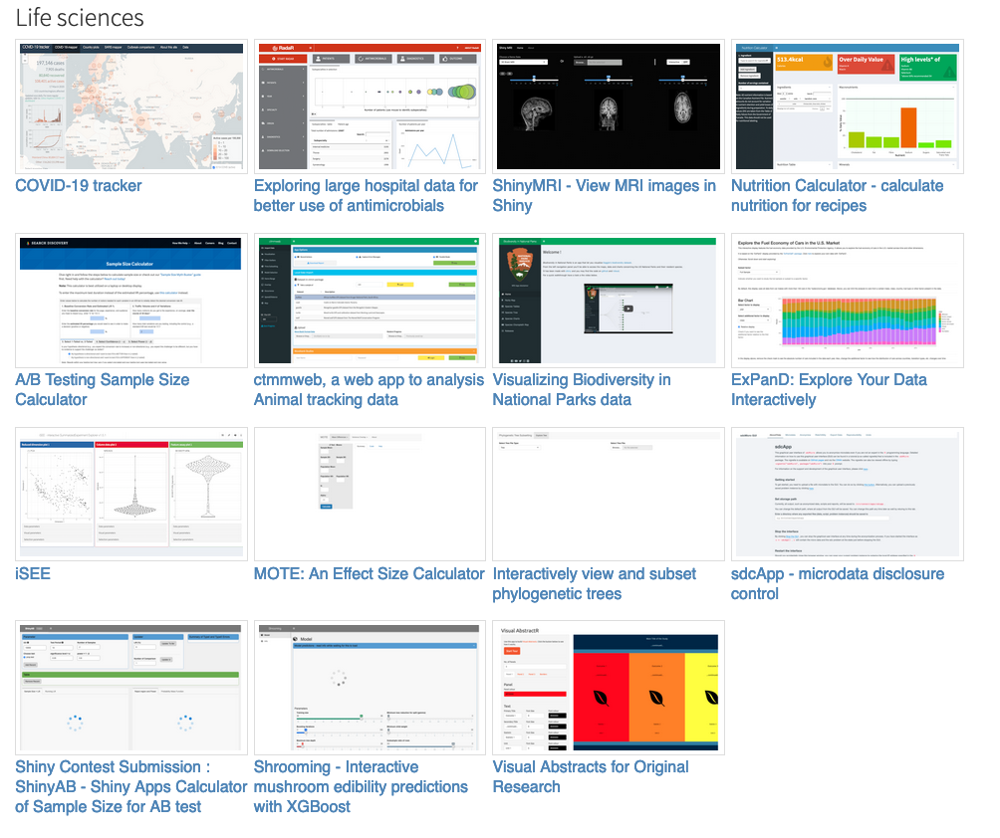
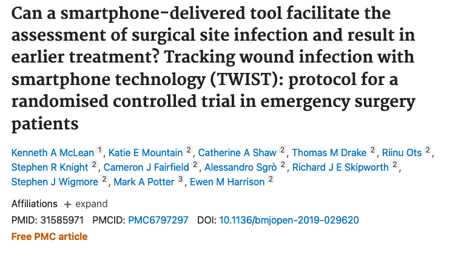
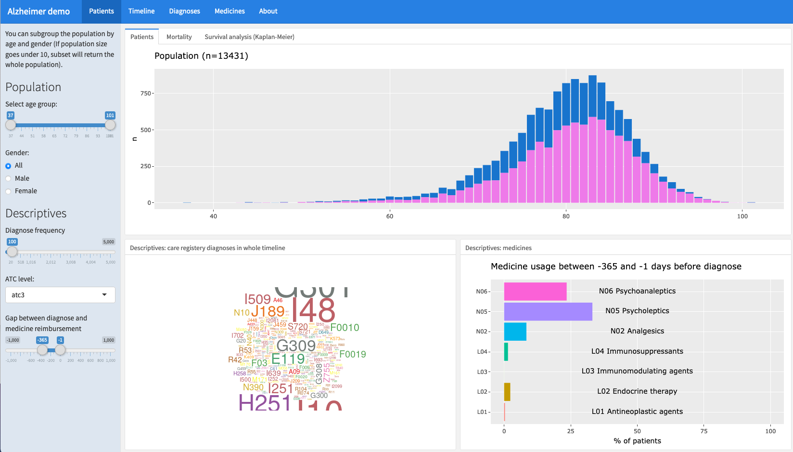
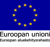

<!-- background-image: url(img/shutterstock_536377753-1536x954.jpg) -->
<!-- background-position: 50% 50% -->
<!-- background-size: cover -->
class: center, middle, inverse

```{r setup, include=FALSE}
options(htmltools.dir.version = FALSE)
```


# **Potilasdatan visualisointi Shiny applikaatiolla**

## *AiHub Webinaari 10.12.2020*

#### Kalvot saatavilla: <https://research.janimiettinen.fi/material/aihub2020/>

<div class="my-header"></div>

---
<div class="my-header"></div>

### Miksi avointa lähdekoodia?

--

- **Vapaasti käytettävissä** - voit käyttää ohjelmaa kuten tahdot (lisenssin ehdoilla)

--

- **Uudelleen toteutettavissa** - edistää avointa tiedettä ja tieteen läpinäkyvyyttä

--

- **Jatkuvuus** - avoin lähdekoodi jää elämään vaikka sitä ei enää aktiivisesti kehittettäisi 

--

- **Yhteisöllisyys** - uudet menetelmät ja kirjastot

--

- **Saatavuus** - kaikki voivat käyttää työvälineitä eikä vaadi kaupallisia ohjelmistolisenssejä

--

Lisää aiheesta esim. *JJ Allaire keynote in RStudio Conf 2020*
<https://rstudio.com/resources/rstudioconf-2020/open-source-software-for-data-science/>

---
background-image: url(https://cran.r-project.org/Rlogo.svg)
background-size: 100px
background-position: 90% 8%

<div class="my-header"></div>


### Miksi R?

[R](https://cran.r-project.org/)-ohjelmisto on perinteisesti erikoistunut **tilastollisiin menetelmiin** eli mistä nykyiset koneoppimismallit ovat lähtöisin. Nykyisin R on verrattavissa **yleisohjelmointikieleen** eli sillä voidaan tehdä mm. *koneoppimista, syväoppimista, isojen aineistojen käsittelyä, tietokantojen käsittelyä, rajapintoja, visualisointeja, verkkosivuja, raportteja, automaatiota ....*

--

**Yhteisö.** R-kielen käyttäjien ympärille on kehittynyt eri tieteenaloilta *laaja ja aktiivinen yhteisö*. Seuraa yhteisöä esimerkiksi:

- Twitterissä [#rstat](https://twitter.com/search?q=%23rstat&src=typed_query) ja [#tidytuesday](https://twitter.com/search?q=%23TidyTuesday&src=typeahead_click)
- [community.rstudio.com](community.rstudio.com) sekä [stackoverflow.com](stackoverflow.com)


--

**Materiaali.** Lisäksi tarjolla laajasti ilmaisia oppikirjoja, esim.

- <https://r4ds.had.co.nz/>
- <https://rstudio-education.github.io/hopr/>
- <https://ggplot2-book.org/>
- <https://bookdown.org/yihui/rmarkdown/>
- <https://bookdown.org/yihui/bookdown/>


---
background-image: url(img/shiny.png)
background-size: 100px
background-position: 90% 8%

<div class="my-header"></div>

### Miksi Shiny-sovellus?

[Shiny](https://rstudio.com/products/shiny/) on R-ohjelmistolle kehitetty paketti, jolla voidaan tehdä interaktiivisia sovelluksia

--

- Ideoiden ja toiminnallisuuksien koestus sekä pilotointi

--

- Kehitys ei vaadi suurta henkilöresurssimäärää, kuten erikseen tilattavat tiedon hyödyntämisratkaisut

--

- Alkuun pääseminen on helppoa ja esimerkkisovelluksia (=*lähdekoodia*) on paljon saatavilla

--



<https://shiny.rstudio.com/gallery/>

---

#### Esimerkki Shiny-applikaatiosta kliinisessä työssä




- Lähde: <https://pubmed.ncbi.nlm.nih.gov/31585971/>

--

Selvitettiin voidaanko leikkaushaavojen infektioiden määrää vähentää puuttumalla tapauksiin nopeammin

--

-> Potilas lähettää kuvan haavasta matkapuhelimella

--

-> Lääkäri antaa palautetta potilaan haavan parantumisesta Shiny-applikaation avulla

--

-> Palaute päivitti samalla potilaantiedot lukuisiin muihin järjestelmiin

---
<div class="my-header"></div>

## Potilasdatan visualisointi 



#### Sovellus*: <https://bioinformatics.uef.fi/alzdemo>

#### Lähdekoodi: <https://github.com/pohjois-savon-tietoallas/demo-alzheimer-shiny>

*Sovellus toimii parhaiten 1920x1080 resoluutiolla

---
<div class="my-header"></div>

## Lähtökohdat ja tavoitteet

- Sovellusta kehitettiin KYS-tietoallas ympäristössä yhteistyössä KYS:n, Roche Oy:n, Uef:n ja Kansallisen Neurokeskuksen asiantuntijoiden kanssa
- Tavoitteena (i) koestaa KYS tietoallasympäristöä, (ii) tarkastella Alzheimer-potilaiden aikajanaa ennen ja jälkeen diagnoosin sekä (iii) jakaa applikaatio avoimena lähdekoodina 
- Aineistona käytettiin syntetisoitua Alzheimer-potilaita koskevaa aineistoa

#### Syntetisoitu aineisto

- Perustiedot henkilöistä (N = 13 431), jotka saaneet Alzheimer lääkkeiden erityiskorvausoikeuden 2002 - 2014 
- Hilmo-tiedot vuosilta 1972 - 2012
- Lääkeostotiedot L01, L02, L04, N02, N05 ja N06 lääkkeiden osalta (1994 - 2012)

---
<div class="my-header"></div>

## Haasteet 

.pull-left[
- **Sovelluksen vasteaika**: sovelluksen toiminta on osittain hidas johtuen siitä, että taustalla tapahtuu aineiston pilkkomista ja laskentaa. Tämä johtuu siitä, että käyttäjällä on mahdollisuus tarkastella *osajoukkoa* koko aineistosta.
- **Aineiston muokkaus**: haluttiin laskea jokainen potilas samalle aikajana-asteikolle, niin että diagnoosin 0-kohta oli verrattivissa potilaiden kesken 
]

.pull-right[
]


---

<div class="my-header"></div>

## Mitä tämä opetti?

.pull-left[
- **Avoin lähdekoodi**: Aineisto oli syntetisoitu, joten sovellus voitiin avata julkiseksi kaikkien saataville. Tämä helpottaa jatkoideoiden työstöä eli sovellusta voidaan jatkossa käyttää referenssinä uusiin ideoihin
- **Aineisto**: useimmissa tutkimuksissa käytetään samankaltaisia aineistoja -> universaalimpi applikaatio, joka on helpompi ottaa käyttöön myös eri tutkimusaiheissa
- **Näkökulman** rajaaminen: Jatkossa on hyvä rajata mitä halutaan tarkastella potilaista, eikä tarkastella kaikkea mahdollista tietoa -> vaikuttaa mm. nopeuteen
]
.pull-right[
]

---
class: center, middle

<div class="my-header"></div>

# Kiitos!

Jani Miettinen </br>
Datatieteilijä </br>
jani.miettinen@uef.fi </br>


<www.neurocenterfinland.fi>

Kalvot saatavilla: <https://research.janimiettinen.fi/material/aihub2020/>


<!--  -->




---
class: center, middle

## About

Slides created via the R package [**xaringan**](https://github.com/yihui/xaringan) with [**Neurocenter Finland** theme](https://github.com/janikmiet/neurocenterslides).

Good vibes comes with [remark.js](https://remarkjs.com), [**knitr**](http://yihui.name/knitr) and [R Markdown](https://rmarkdown.rstudio.com).
